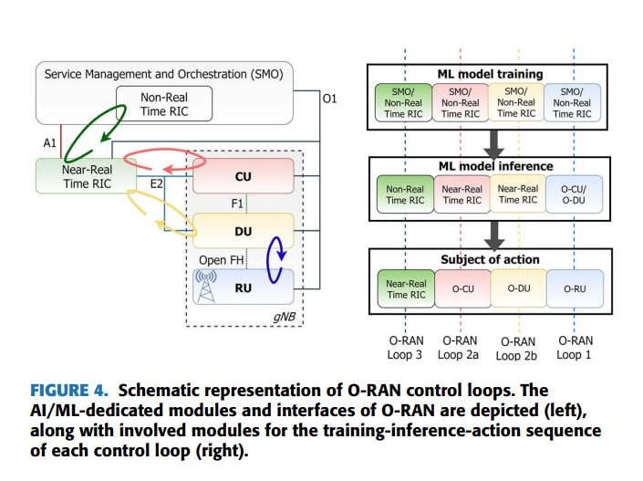

# Read Me

 - The implementation consists of 3 algorithms
    - ARIMA 
    - SARIMAX 
    - Gaussian Processes for Time Series.
 - Data used
   - pythonTaskLinearSineData - Linear Data generated from scratch in python - has two seasonal components + noise + linear trend
   - pythonTaskNonLinearSineData - Non-linear Data generated from scratch in python - has two seasonal components + noise + non-linear trend
   - pythonTaskRealData, pythonTaskAnotherRealData - Two sets of real data taken from Kaggle

### Q4 - Provide a conceptual guideline for integration such solutions in real testbed hosting full RAN components in edge cloud continuum

 - [Source](https://www.affordable5g.eu/wp-content/uploads/sites/63/2022/10/Supporting_Intelligence_in_Disaggregated_Open_Radio_Access_Networks_Architectural_Principles_AI_ML_Workflow_and_Use_Cases.pdf)

- Our time series forecasting scenario concerns loop 2 of the O-RAN architecture.
- Control Loop 2 operates in the Near-RT RIC and
is responsible for decisions within the range of
10-500 msec and above (resource optimization).
- Network Telemetry node collects the data e.g., network load performance in an area of interest
- Train at SMO/Non-Real Time RIC